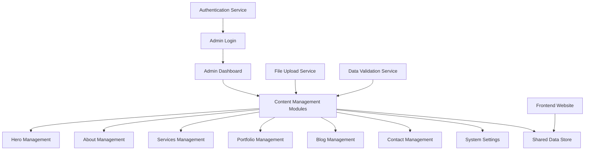

# Design Document

## Overview

The admin dashboard will be a comprehensive content management system for the "Nhật Anh Dev - Freelance Fullstack" portfolio website. It will feature a pixel art retro aesthetic that matches the main website's theme, providing administrators with intuitive tools to manage all website content including hero sections, services, portfolio projects, blog posts, contact information, and system settings.

The dashboard will be built as a separate admin section within the existing React/TypeScript application, leveraging the current component architecture and design system while extending it with admin-specific functionality.

## Architecture

### High-Level Architecture



### Technical Stack Integration

- **Frontend Framework**: React 18 with TypeScript (existing)
- **Styling**: Tailwind CSS with custom pixel art theme (extending existing)
- **UI Components**: shadcn/ui components with custom pixel variants (extending existing)
- **State Management**: React Context API for admin state + existing language context
- **Routing**: React Router with protected admin routes
- **Data Storage**: Local Storage for demo purposes (can be extended to API later)
- **File Handling**: Browser File API for image uploads with client-side optimization

### Folder Structure

```
front-end/src/
├── components/
│   ├── admin/
│   │   ├── layout/
│   │   │   ├── AdminLayout.tsx
│   │   │   ├── AdminSidebar.tsx
│   │   │   └── AdminHeader.tsx
│   │   ├── forms/
│   │   │   ├── HeroForm.tsx
│   │   │   ├── AboutForm.tsx
│   │   │   ├── ServiceForm.tsx
│   │   │   ├── ProjectForm.tsx
│   │   │   ├── BlogForm.tsx
│   │   │   └── ContactForm.tsx
│   │   ├── ui/
│   │   │   ├── PixelButton.tsx
│   │   │   ├── PixelInput.tsx
│   │   │   ├── PixelTextarea.tsx
│   │   │   ├── PixelSelect.tsx
│   │   │   ├── ImageUpload.tsx
│   │   │   └── MarkdownEditor.tsx
│   │   └── pages/
│   │       ├── AdminLogin.tsx
│   │       ├── AdminDashboard.tsx
│   │       ├── HeroManager.tsx
│   │       ├── AboutManager.tsx
│   │       ├── ServicesManager.tsx
│   │       ├── PortfolioManager.tsx
│   │       ├── BlogManager.tsx
│   │       ├── ContactManager.tsx
│   │       └── SystemSettings.tsx
├── hooks/
│   ├── admin/
│   │   ├── useAdminAuth.ts
│   │   ├── useAdminData.ts
│   │   └── useFileUpload.ts
├── contexts/
│   └── AdminContext.tsx
├── pages/
│   └── admin/
│       └── AdminApp.tsx
└── types/
    └── admin.ts
```

## Components and Interfaces

### Core Admin Components

#### AdminLayout Component
```typescript
interface AdminLayoutProps {
  children: React.ReactNode;
}

// Provides the main layout structure with sidebar navigation and content area
// Handles responsive behavior for mobile/tablet/desktop
// Integrates with authentication context to protect routes
```

#### AdminSidebar Component
```typescript
interface AdminSidebarProps {
  currentSection: string;
  onSectionChange: (section: string) => void;
}

// Navigation menu with pixel art styling
// Collapsible on mobile devices
// Active state indicators for current section
```

#### PixelButton Component
```typescript
interface PixelButtonProps extends ButtonHTMLAttributes<HTMLButtonElement> {
  variant: 'primary' | 'secondary' | 'danger' | 'success';
  size: 'sm' | 'md' | 'lg';
  pixelStyle?: boolean;
}

// Custom button component with retro pixel styling
// Hover and active state animations
// Consistent with main website theme
```

#### ImageUpload Component
```typescript
interface ImageUploadProps {
  onUpload: (file: File, preview: string) => void;
  currentImage?: string;
  acceptedTypes: string[];
  maxSize: number;
  pixelArt?: boolean;
}

// Drag-and-drop file upload with preview
// Image optimization for web display
// Pixel art style validation and processing
```

#### MarkdownEditor Component
```typescript
interface MarkdownEditorProps {
  value: string;
  onChange: (value: string) => void;
  placeholder?: string;
  height?: string;
}

// Split-pane editor with live preview
// Basic markdown toolbar
// Syntax highlighting for markdown
```

### Data Management Interfaces

#### Admin Data Types
```typescript
interface AdminUser {
  username: string;
  isAuthenticated: boolean;
  loginTime: Date;
}

interface HeroContent {
  greeting: { vi: string; en: string };
  name: string;
  title: { vi: string; en: string };
  subtitle: { vi: string; en: string };
  ctaText: { vi: string; en: string };
  ctaLink: string;
}

interface AboutContent {
  description: { vi: string; en: string };
  profileImage: string;
  experience: { vi: string; en: string };
}

interface Service {
  id: string;
  title: { vi: string; en: string };
  description: { vi: string; en: string };
  icon: string;
  color: string;
  bgColor: string;
  order: number;
}

interface Project {
  id: string;
  title: { vi: string; en: string };
  description: { vi: string; en: string };
  image: string;
  link?: string;
  technologies: string[];
  category: string;
  featured: boolean;
  order: number;
}

interface BlogPost {
  id: string;
  title: { vi: string; en: string };
  content: { vi: string; en: string };
  excerpt: { vi: string; en: string };
  thumbnail: string;
  publishDate: Date;
  status: 'draft' | 'published';
  tags: string[];
}

interface ContactMessage {
  id: string;
  name: string;
  email: string;
  message: string;
  timestamp: Date;
  read: boolean;
}

interface ContactInfo {
  email: string;
  phone: string;
  github: string;
  linkedin: string;
}

interface SystemSettings {
  defaultLanguage: 'vi' | 'en';
  defaultTheme: 'light' | 'dark';
  colorPalette: string[];
  maintenanceMode: boolean;
}
```

## Data Models

### Admin Context Structure
```typescript
interface AdminContextType {
  // Authentication
  user: AdminUser | null;
  login: (username: string, password: string) => Promise<boolean>;
  logout: () => void;
  
  // Content Management
  heroContent: HeroContent;
  aboutContent: AboutContent;
  services: Service[];
  projects: Project[];
  blogPosts: BlogPost[];
  contactMessages: ContactMessage[];
  contactInfo: ContactInfo;
  systemSettings: SystemSettings;
  
  // CRUD Operations
  updateHeroContent: (content: Partial<HeroContent>) => void;
  updateAboutContent: (content: Partial<AboutContent>) => void;
  addService: (service: Omit<Service, 'id'>) => void;
  updateService: (id: string, service: Partial<Service>) => void;
  deleteService: (id: string) => void;
  reorderServices: (services: Service[]) => void;
  
  addProject: (project: Omit<Project, 'id'>) => void;
  updateProject: (id: string, project: Partial<Project>) => void;
  deleteProject: (id: string) => void;
  reorderProjects: (projects: Project[]) => void;
  
  addBlogPost: (post: Omit<BlogPost, 'id'>) => void;
  updateBlogPost: (id: string, post: Partial<BlogPost>) => void;
  deleteBlogPost: (id: string) => void;
  publishBlogPost: (id: string) => void;
  
  markMessageAsRead: (id: string) => void;
  deleteMessage: (id: string) => void;
  bulkDeleteMessages: (ids: string[]) => void;
  
  updateContactInfo: (info: Partial<ContactInfo>) => void;
  updateSystemSettings: (settings: Partial<SystemSettings>) => void;
  
  // File Management
  uploadImage: (file: File, category: string) => Promise<string>;
  deleteImage: (url: string) => void;
}
```

### Local Storage Schema
```typescript
// Storage keys for different data types
const STORAGE_KEYS = {
  ADMIN_USER: 'admin_user',
  HERO_CONTENT: 'admin_hero_content',
  ABOUT_CONTENT: 'admin_about_content',
  SERVICES: 'admin_services',
  PROJECTS: 'admin_projects',
  BLOG_POSTS: 'admin_blog_posts',
  CONTACT_MESSAGES: 'admin_contact_messages',
  CONTACT_INFO: 'admin_contact_info',
  SYSTEM_SETTINGS: 'admin_system_settings',
  UPLOADED_IMAGES: 'admin_uploaded_images'
};
```

## Error Handling

### Error Types and Handling Strategy

```typescript
interface AdminError {
  type: 'validation' | 'authentication' | 'storage' | 'upload' | 'network';
  message: string;
  field?: string;
  code?: string;
}

// Error handling patterns:
// 1. Form validation errors - displayed inline with form fields
// 2. Authentication errors - displayed on login form with retry options
// 3. Storage errors - displayed as toast notifications with retry actions
// 4. Upload errors - displayed with upload component with clear error messages
// 5. Network errors - displayed as global notifications with offline indicators
```

### Error Boundaries
- Global error boundary for the admin section
- Form-specific error boundaries for complex forms
- Upload error handling with progress indicators
- Graceful degradation for offline scenarios

### Validation Strategy
- Client-side validation for immediate feedback
- Schema validation using Zod or similar library
- File type and size validation for uploads
- Required field validation with clear error messages
- Internationalized error messages (VI/EN)

## Testing Strategy

### Unit Testing
- Component testing with React Testing Library
- Hook testing for custom admin hooks
- Utility function testing for data transformations
- Form validation testing

### Integration Testing
- Admin workflow testing (login → content management → save)
- File upload integration testing
- Context provider integration testing
- Routing and navigation testing

### E2E Testing
- Complete admin user journeys
- Cross-browser compatibility testing
- Responsive design testing across devices
- Performance testing for large datasets

### Testing Tools
- Jest for unit testing
- React Testing Library for component testing
- MSW (Mock Service Worker) for API mocking
- Cypress or Playwright for E2E testing

## Security Considerations

### Authentication Security
- Secure credential storage (hashed passwords in production)
- Session timeout and automatic logout
- CSRF protection for form submissions
- Input sanitization for all user inputs

### Data Security
- XSS prevention through proper escaping
- File upload security (type validation, size limits)
- Secure image handling and storage
- Data validation and sanitization

### Access Control
- Role-based access control (extensible for multiple admin users)
- Protected routes with authentication guards
- Audit logging for admin actions
- Secure logout and session cleanup

## Performance Optimization

### Loading Performance
- Code splitting for admin routes
- Lazy loading of admin components
- Image optimization and compression
- Efficient bundle splitting

### Runtime Performance
- Memoization of expensive computations
- Virtual scrolling for large lists
- Debounced search and filtering
- Optimized re-renders with React.memo

### Storage Performance
- Efficient local storage usage
- Data compression for large datasets
- Cleanup of unused stored data
- Batch operations for bulk updates

## Accessibility

### WCAG Compliance
- Keyboard navigation support
- Screen reader compatibility
- High contrast mode support
- Focus management and indicators

### Pixel Art Accessibility
- Alternative text for pixel art icons
- Sufficient color contrast ratios
- Scalable pixel fonts for readability
- Touch-friendly controls on mobile

### Internationalization
- RTL language support preparation
- Accessible form labels in both languages
- Consistent navigation patterns
- Cultural considerations for UI patterns