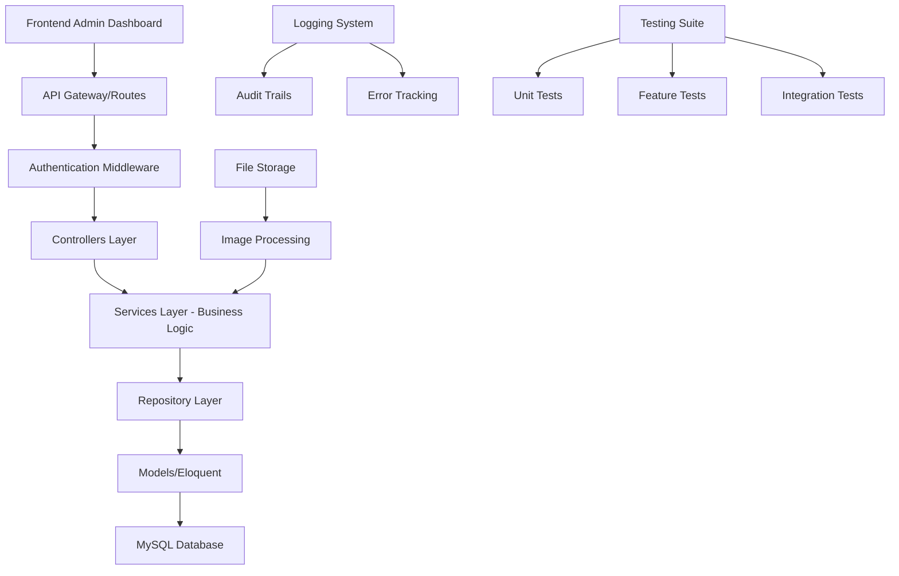
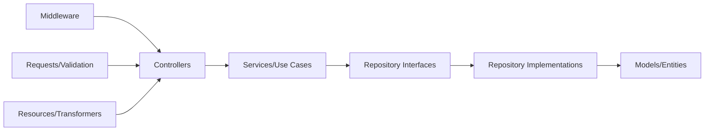

# Design Document

## Overview

The Laravel Admin Backend API will serve as a robust, scalable backend system for the "Nhật Anh Dev - Freelance Fullstack" portfolio admin dashboard. Built with Laravel 10+ and PHP 8+, it implements Clean Architecture principles, providing RESTful APIs for content management with comprehensive authentication, logging, and testing capabilities.

The system follows Domain-Driven Design (DDD) principles with clear separation of concerns across Controllers, Services, Repositories, and Models. It uses Laravel Sanctum for API authentication, implements comprehensive logging for audit trails, and includes extensive testing coverage.

## Architecture

### High-Level Architecture



### Clean Architecture Layers



### Directory Structure

```
app/
├── Http/
│   ├── Controllers/
│   │   └── Admin/
│   │       ├── AuthController.php
│   │       ├── HeroController.php
│   │       ├── AboutController.php
│   │       ├── ServiceController.php
│   │       ├── ProjectController.php
│   │       ├── BlogController.php
│   │       ├── ContactController.php
│   │       └── SettingsController.php
│   ├── Middleware/
│   │   └── AdminAuthMiddleware.php
│   ├── Requests/
│   │   └── Admin/
│   │       ├── HeroRequest.php
│   │       ├── AboutRequest.php
│   │       ├── ServiceRequest.php
│   │       ├── ProjectRequest.php
│   │       ├── BlogRequest.php
│   │       └── SettingsRequest.php
│   └── Resources/
│       └── Admin/
│           ├── HeroResource.php
│           ├── ServiceResource.php
│           ├── ProjectResource.php
│           └── BlogResource.php
├── Services/
│   └── Admin/
│       ├── AuthService.php
│       ├── HeroService.php
│       ├── AboutService.php
│       ├── ServiceManagementService.php
│       ├── ProjectService.php
│       ├── BlogService.php
│       ├── ContactService.php
│       ├── SettingsService.php
│       └── FileUploadService.php
├── Repositories/
│   ├── Contracts/
│   │   ├── HeroRepositoryInterface.php
│   │   ├── AboutRepositoryInterface.php
│   │   ├── ServiceRepositoryInterface.php
│   │   ├── ProjectRepositoryInterface.php
│   │   ├── BlogRepositoryInterface.php
│   │   ├── ContactRepositoryInterface.php
│   │   └── SettingsRepositoryInterface.php
│   └── Eloquent/
│       ├── HeroRepository.php
│       ├── AboutRepository.php
│       ├── ServiceRepository.php
│       ├── ProjectRepository.php
│       ├── BlogRepository.php
│       ├── ContactRepository.php
│       └── SettingsRepository.php
├── Models/
│   ├── Admin.php
│   ├── Hero.php
│   ├── About.php
│   ├── Service.php
│   ├── Project.php
│   ├── BlogPost.php
│   ├── ContactMessage.php
│   ├── ContactInfo.php
│   └── SystemSettings.php
├── Exceptions/
│   ├── AdminAuthException.php
│   ├── ValidationException.php
│   └── FileUploadException.php
└── Providers/
    └── RepositoryServiceProvider.php
```

## Components and Interfaces

### Authentication System

#### AuthController
```php
class AuthController extends Controller
{
    public function __construct(
        private AuthService $authService
    ) {}

    public function login(LoginRequest $request): JsonResponse
    public function logout(Request $request): JsonResponse
    public function refresh(Request $request): JsonResponse
    public function me(Request $request): JsonResponse
}
```

#### AuthService
```php
class AuthService
{
    public function authenticate(string $username, string $password): array
    public function logout(string $token): bool
    public function refreshToken(string $token): array
    public function getCurrentUser(string $token): Admin
}
```

### Content Management Controllers

#### HeroController
```php
class HeroController extends Controller
{
    public function __construct(
        private HeroService $heroService
    ) {}

    public function show(): JsonResponse
    public function update(HeroRequest $request): JsonResponse
}
```

#### ServiceController
```php
class ServiceController extends Controller
{
    public function __construct(
        private ServiceManagementService $serviceService
    ) {}

    public function index(): JsonResponse
    public function store(ServiceRequest $request): JsonResponse
    public function show(int $id): JsonResponse
    public function update(ServiceRequest $request, int $id): JsonResponse
    public function destroy(int $id): JsonResponse
    public function reorder(ReorderRequest $request): JsonResponse
}
```

### Service Layer Architecture

#### Base Service Interface
```php
interface BaseServiceInterface
{
    public function validateData(array $data): array;
    public function logAction(string $action, array $data, ?int $userId = null): void;
}
```

#### HeroService
```php
class HeroService implements BaseServiceInterface
{
    public function __construct(
        private HeroRepositoryInterface $heroRepository,
        private LoggerInterface $logger
    ) {}

    public function getHeroContent(): array
    public function updateHeroContent(array $data): Hero
    public function validateHeroData(array $data): array
}
```

#### ProjectService
```php
class ProjectService implements BaseServiceInterface
{
    public function __construct(
        private ProjectRepositoryInterface $projectRepository,
        private FileUploadService $fileUploadService,
        private LoggerInterface $logger
    ) {}

    public function getAllProjects(array $filters = []): Collection
    public function createProject(array $data): Project
    public function updateProject(int $id, array $data): Project
    public function deleteProject(int $id): bool
    public function toggleFeatured(int $id): Project
    public function reorderProjects(array $order): bool
}
```

### Repository Pattern Implementation

#### Repository Interface Example
```php
interface ProjectRepositoryInterface
{
    public function findAll(array $filters = []): Collection;
    public function findById(int $id): ?Project;
    public function create(array $data): Project;
    public function update(int $id, array $data): Project;
    public function delete(int $id): bool;
    public function updateOrder(array $order): bool;
    public function findFeatured(): Collection;
    public function findByCategory(string $category): Collection;
}
```

#### Repository Implementation
```php
class ProjectRepository implements ProjectRepositoryInterface
{
    public function __construct(
        private Project $model
    ) {}

    public function findAll(array $filters = []): Collection
    {
        $query = $this->model->newQuery();
        
        if (isset($filters['category'])) {
            $query->where('category', $filters['category']);
        }
        
        if (isset($filters['featured'])) {
            $query->where('featured', $filters['featured']);
        }
        
        return $query->orderBy('order')->get();
    }

    public function create(array $data): Project
    {
        return $this->model->create($data);
    }

    // Additional methods...
}
```

## Data Models

### Database Schema Design

#### Admin Model
```php
class Admin extends Authenticatable
{
    use HasApiTokens, Notifiable;

    protected $fillable = [
        'username',
        'email', 
        'password',
        'last_login_at'
    ];

    protected $hidden = [
        'password',
        'remember_token'
    ];

    protected $casts = [
        'last_login_at' => 'datetime'
    ];
}
```

#### Hero Model
```php
class Hero extends Model
{
    protected $fillable = [
        'greeting_vi',
        'greeting_en',
        'name',
        'title_vi',
        'title_en',
        'subtitle_vi',
        'subtitle_en',
        'cta_text_vi',
        'cta_text_en',
        'cta_link'
    ];

    protected $casts = [
        'updated_at' => 'datetime'
    ];
}
```

#### Service Model
```php
class Service extends Model
{
    protected $fillable = [
        'title_vi',
        'title_en',
        'description_vi',
        'description_en',
        'icon',
        'color',
        'bg_color',
        'order'
    ];

    protected $casts = [
        'order' => 'integer'
    ];
}
```

#### Project Model
```php
class Project extends Model
{
    protected $fillable = [
        'title_vi',
        'title_en',
        'description_vi',
        'description_en',
        'image',
        'link',
        'technologies',
        'category',
        'featured',
        'order'
    ];

    protected $casts = [
        'technologies' => 'array',
        'featured' => 'boolean',
        'order' => 'integer'
    ];
}
```

#### BlogPost Model
```php
class BlogPost extends Model
{
    protected $fillable = [
        'title_vi',
        'title_en',
        'content_vi',
        'content_en',
        'excerpt_vi',
        'excerpt_en',
        'thumbnail',
        'status',
        'published_at',
        'tags'
    ];

    protected $casts = [
        'published_at' => 'datetime',
        'tags' => 'array'
    ];

    public function scopePublished($query)
    {
        return $query->where('status', 'published');
    }

    public function scopeDraft($query)
    {
        return $query->where('status', 'draft');
    }
}
```

#### ContactMessage Model
```php
class ContactMessage extends Model
{
    protected $fillable = [
        'name',
        'email',
        'message',
        'read_at'
    ];

    protected $casts = [
        'read_at' => 'datetime'
    ];

    public function scopeUnread($query)
    {
        return $query->whereNull('read_at');
    }

    public function markAsRead(): void
    {
        $this->update(['read_at' => now()]);
    }
}
```

### Database Migrations

```php
// Create admins table
Schema::create('admins', function (Blueprint $table) {
    $table->id();
    $table->string('username')->unique();
    $table->string('email')->unique();
    $table->timestamp('email_verified_at')->nullable();
    $table->string('password');
    $table->timestamp('last_login_at')->nullable();
    $table->rememberToken();
    $table->timestamps();
});

// Create heroes table
Schema::create('heroes', function (Blueprint $table) {
    $table->id();
    $table->text('greeting_vi');
    $table->text('greeting_en');
    $table->string('name');
    $table->text('title_vi');
    $table->text('title_en');
    $table->text('subtitle_vi');
    $table->text('subtitle_en');
    $table->string('cta_text_vi');
    $table->string('cta_text_en');
    $table->string('cta_link');
    $table->timestamps();
});

// Create services table
Schema::create('services', function (Blueprint $table) {
    $table->id();
    $table->string('title_vi');
    $table->string('title_en');
    $table->text('description_vi');
    $table->text('description_en');
    $table->string('icon');
    $table->string('color');
    $table->string('bg_color');
    $table->integer('order')->default(0);
    $table->timestamps();
});

// Create projects table
Schema::create('projects', function (Blueprint $table) {
    $table->id();
    $table->string('title_vi');
    $table->string('title_en');
    $table->text('description_vi');
    $table->text('description_en');
    $table->string('image');
    $table->string('link')->nullable();
    $table->json('technologies');
    $table->string('category');
    $table->boolean('featured')->default(false);
    $table->integer('order')->default(0);
    $table->timestamps();
});
```

## Error Handling

### Custom Exception Classes

#### AdminAuthException
```php
class AdminAuthException extends Exception
{
    public static function invalidCredentials(): self
    {
        return new self('Invalid admin credentials provided', 401);
    }

    public static function tokenExpired(): self
    {
        return new self('Authentication token has expired', 401);
    }

    public static function unauthorized(): self
    {
        return new self('Unauthorized access to admin resources', 403);
    }
}
```

#### ValidationException
```php
class ValidationException extends Exception
{
    private array $errors;

    public function __construct(array $errors, string $message = 'Validation failed')
    {
        parent::__construct($message, 422);
        $this->errors = $errors;
    }

    public function getErrors(): array
    {
        return $this->errors;
    }
}
```

### Global Exception Handler

```php
class Handler extends ExceptionHandler
{
    public function render($request, Throwable $exception)
    {
        if ($request->expectsJson()) {
            return $this->handleApiException($exception);
        }

        return parent::render($request, $exception);
    }

    private function handleApiException(Throwable $exception): JsonResponse
    {
        $statusCode = 500;
        $message = 'Internal Server Error';
        $errors = [];

        if ($exception instanceof AdminAuthException) {
            $statusCode = $exception->getCode();
            $message = $exception->getMessage();
        } elseif ($exception instanceof ValidationException) {
            $statusCode = 422;
            $message = 'Validation Error';
            $errors = $exception->getErrors();
        } elseif ($exception instanceof ModelNotFoundException) {
            $statusCode = 404;
            $message = 'Resource not found';
        }

        // Log the exception
        Log::error('API Exception', [
            'exception' => get_class($exception),
            'message' => $exception->getMessage(),
            'file' => $exception->getFile(),
            'line' => $exception->getLine(),
            'trace' => $exception->getTraceAsString()
        ]);

        return response()->json([
            'success' => false,
            'message' => $message,
            'errors' => $errors
        ], $statusCode);
    }
}
```

## Testing Strategy

### Unit Testing Structure

#### Service Layer Tests
```php
class HeroServiceTest extends TestCase
{
    use RefreshDatabase;

    private HeroService $heroService;
    private HeroRepositoryInterface $heroRepository;

    protected function setUp(): void
    {
        parent::setUp();
        
        $this->heroRepository = Mockery::mock(HeroRepositoryInterface::class);
        $this->heroService = new HeroService(
            $this->heroRepository,
            Log::getFacadeRoot()
        );
    }

    /** @test */
    public function it_can_update_hero_content(): void
    {
        // Arrange
        $heroData = [
            'greeting_vi' => 'Xin chào',
            'greeting_en' => 'Hello',
            'name' => 'Nhật Anh'
        ];

        $hero = new Hero($heroData);
        
        $this->heroRepository
            ->shouldReceive('update')
            ->once()
            ->with($heroData)
            ->andReturn($hero);

        // Act
        $result = $this->heroService->updateHeroContent($heroData);

        // Assert
        $this->assertInstanceOf(Hero::class, $result);
        $this->assertEquals('Xin chào', $result->greeting_vi);
    }
}
```

#### Repository Tests
```php
class ProjectRepositoryTest extends TestCase
{
    use RefreshDatabase;

    private ProjectRepository $repository;

    protected function setUp(): void
    {
        parent::setUp();
        $this->repository = new ProjectRepository(new Project());
    }

    /** @test */
    public function it_can_create_project(): void
    {
        // Arrange
        $projectData = [
            'title_vi' => 'Dự án test',
            'title_en' => 'Test project',
            'description_vi' => 'Mô tả dự án',
            'description_en' => 'Project description',
            'category' => 'web',
            'technologies' => ['Laravel', 'Vue.js']
        ];

        // Act
        $project = $this->repository->create($projectData);

        // Assert
        $this->assertInstanceOf(Project::class, $project);
        $this->assertEquals('Test project', $project->title_en);
        $this->assertDatabaseHas('projects', ['title_en' => 'Test project']);
    }
}
```

### Feature Testing

#### API Endpoint Tests
```php
class AdminAuthTest extends TestCase
{
    use RefreshDatabase;

    /** @test */
    public function admin_can_login_with_valid_credentials(): void
    {
        // Arrange
        $admin = Admin::factory()->create([
            'username' => 'admin',
            'password' => Hash::make('password123')
        ]);

        // Act
        $response = $this->postJson('/api/admin/auth/login', [
            'username' => 'admin',
            'password' => 'password123'
        ]);

        // Assert
        $response->assertStatus(200)
                ->assertJsonStructure([
                    'success',
                    'data' => [
                        'token',
                        'user' => [
                            'id',
                            'username',
                            'email'
                        ]
                    ]
                ]);
    }

    /** @test */
    public function admin_cannot_access_protected_routes_without_token(): void
    {
        // Act
        $response = $this->getJson('/api/admin/hero');

        // Assert
        $response->assertStatus(401)
                ->assertJson([
                    'success' => false,
                    'message' => 'Unauthenticated'
                ]);
    }
}
```

#### CRUD Operation Tests
```php
class ServiceManagementTest extends TestCase
{
    use RefreshDatabase;

    private Admin $admin;
    private string $token;

    protected function setUp(): void
    {
        parent::setUp();
        
        $this->admin = Admin::factory()->create();
        $this->token = $this->admin->createToken('test-token')->plainTextToken;
    }

    /** @test */
    public function admin_can_create_service(): void
    {
        // Arrange
        $serviceData = [
            'title_vi' => 'Phát triển web',
            'title_en' => 'Web Development',
            'description_vi' => 'Mô tả dịch vụ',
            'description_en' => 'Service description',
            'icon' => 'web-icon',
            'color' => '#FF6B6B',
            'bg_color' => '#FFE5E5'
        ];

        // Act
        $response = $this->withHeaders([
            'Authorization' => 'Bearer ' . $this->token
        ])->postJson('/api/admin/services', $serviceData);

        // Assert
        $response->assertStatus(201)
                ->assertJsonStructure([
                    'success',
                    'data' => [
                        'id',
                        'title_vi',
                        'title_en',
                        'order'
                    ]
                ]);

        $this->assertDatabaseHas('services', [
            'title_en' => 'Web Development'
        ]);
    }
}
```

### Integration Testing

#### File Upload Integration
```php
class FileUploadIntegrationTest extends TestCase
{
    use RefreshDatabase;

    /** @test */
    public function admin_can_upload_project_image(): void
    {
        // Arrange
        Storage::fake('public');
        $admin = Admin::factory()->create();
        $token = $admin->createToken('test')->plainTextToken;
        
        $file = UploadedFile::fake()->image('project.jpg', 800, 600);

        // Act
        $response = $this->withHeaders([
            'Authorization' => 'Bearer ' . $token
        ])->postJson('/api/admin/projects', [
            'title_vi' => 'Test Project',
            'title_en' => 'Test Project',
            'description_vi' => 'Description',
            'description_en' => 'Description',
            'image' => $file,
            'category' => 'web',
            'technologies' => ['Laravel']
        ]);

        // Assert
        $response->assertStatus(201);
        Storage::disk('public')->assertExists('projects/' . $file->hashName());
    }
}
```

## Security Considerations

### Authentication & Authorization

#### Sanctum Configuration
```php
// config/sanctum.php
return [
    'stateful' => explode(',', env('SANCTUM_STATEFUL_DOMAINS', sprintf(
        '%s%s',
        'localhost,localhost:3000,127.0.0.1,127.0.0.1:8000,::1',
        Sanctum::currentApplicationUrlWithPort()
    ))),

    'guard' => ['web'],

    'expiration' => 60 * 24, // 24 hours

    'middleware' => [
        'verify_csrf_token' => App\Http\Middleware\VerifyCsrfToken::class,
        'encrypt_cookies' => App\Http\Middleware\EncryptCookies::class,
    ],
];
```

#### Admin Authentication Middleware
```php
class AdminAuthMiddleware
{
    public function handle(Request $request, Closure $next): Response
    {
        if (!$request->user('sanctum') instanceof Admin) {
            throw AdminAuthException::unauthorized();
        }

        // Log admin access
        Log::info('Admin API Access', [
            'admin_id' => $request->user()->id,
            'endpoint' => $request->path(),
            'method' => $request->method(),
            'ip' => $request->ip(),
            'user_agent' => $request->userAgent()
        ]);

        return $next($request);
    }
}
```

### Input Validation & Sanitization

#### Request Validation Classes
```php
class ServiceRequest extends FormRequest
{
    public function authorize(): bool
    {
        return $this->user() instanceof Admin;
    }

    public function rules(): array
    {
        return [
            'title_vi' => 'required|string|max:255',
            'title_en' => 'required|string|max:255',
            'description_vi' => 'required|string|max:1000',
            'description_en' => 'required|string|max:1000',
            'icon' => 'required|string|max:100',
            'color' => 'required|regex:/^#[0-9A-Fa-f]{6}$/',
            'bg_color' => 'required|regex:/^#[0-9A-Fa-f]{6}$/'
        ];
    }

    public function messages(): array
    {
        return [
            'title_vi.required' => 'Vietnamese title is required',
            'title_en.required' => 'English title is required',
            'color.regex' => 'Color must be a valid hex color code',
            'bg_color.regex' => 'Background color must be a valid hex color code'
        ];
    }
}
```

### File Upload Security

#### Secure File Upload Service
```php
class FileUploadService
{
    private const ALLOWED_IMAGE_TYPES = ['jpg', 'jpeg', 'png', 'gif', 'webp'];
    private const MAX_FILE_SIZE = 5 * 1024 * 1024; // 5MB

    public function uploadImage(UploadedFile $file, string $directory): string
    {
        $this->validateImageFile($file);
        
        $filename = $this->generateSecureFilename($file);
        $path = $file->storeAs("public/{$directory}", $filename);
        
        // Log upload
        Log::info('File uploaded', [
            'original_name' => $file->getClientOriginalName(),
            'stored_name' => $filename,
            'size' => $file->getSize(),
            'mime_type' => $file->getMimeType()
        ]);
        
        return Storage::url($path);
    }

    private function validateImageFile(UploadedFile $file): void
    {
        if ($file->getSize() > self::MAX_FILE_SIZE) {
            throw new FileUploadException('File size exceeds maximum allowed size');
        }

        $extension = strtolower($file->getClientOriginalExtension());
        if (!in_array($extension, self::ALLOWED_IMAGE_TYPES)) {
            throw new FileUploadException('Invalid file type. Only images are allowed');
        }

        // Additional MIME type validation
        $mimeType = $file->getMimeType();
        if (!str_starts_with($mimeType, 'image/')) {
            throw new FileUploadException('Invalid file content. Only images are allowed');
        }
    }

    private function generateSecureFilename(UploadedFile $file): string
    {
        $extension = $file->getClientOriginalExtension();
        return Str::random(40) . '.' . $extension;
    }
}
```

## Performance Optimization

### Database Optimization

#### Query Optimization
```php
class ProjectRepository implements ProjectRepositoryInterface
{
    public function findAllWithOptimization(array $filters = []): Collection
    {
        return $this->model
            ->select(['id', 'title_vi', 'title_en', 'image', 'featured', 'order'])
            ->when(isset($filters['featured']), function ($query) use ($filters) {
                return $query->where('featured', $filters['featured']);
            })
            ->when(isset($filters['category']), function ($query) use ($filters) {
                return $query->where('category', $filters['category']);
            })
            ->orderBy('order')
            ->orderBy('created_at', 'desc')
            ->get();
    }
}
```

#### Database Indexing
```php
// Migration indexes
Schema::table('projects', function (Blueprint $table) {
    $table->index(['featured', 'order']);
    $table->index('category');
    $table->index('created_at');
});

Schema::table('blog_posts', function (Blueprint $table) {
    $table->index(['status', 'published_at']);
    $table->index('created_at');
});

Schema::table('contact_messages', function (Blueprint $table) {
    $table->index('read_at');
    $table->index('created_at');
});
```

### Caching Strategy

#### Redis Caching Implementation
```php
class HeroService
{
    public function getHeroContent(): array
    {
        return Cache::remember('hero_content', 3600, function () {
            return $this->heroRepository->getContent();
        });
    }

    public function updateHeroContent(array $data): Hero
    {
        $hero = $this->heroRepository->update($data);
        
        // Clear cache
        Cache::forget('hero_content');
        
        return $hero;
    }
}
```

### API Response Optimization

#### Resource Transformers
```php
class ProjectResource extends JsonResource
{
    public function toArray($request): array
    {
        return [
            'id' => $this->id,
            'title' => [
                'vi' => $this->title_vi,
                'en' => $this->title_en
            ],
            'description' => [
                'vi' => $this->description_vi,
                'en' => $this->description_en
            ],
            'image' => $this->image,
            'link' => $this->link,
            'technologies' => $this->technologies,
            'category' => $this->category,
            'featured' => $this->featured,
            'order' => $this->order,
            'created_at' => $this->created_at->toISOString(),
            'updated_at' => $this->updated_at->toISOString()
        ];
    }
}
```

This comprehensive design provides a solid foundation for implementing a robust, scalable Laravel backend API that follows Clean Architecture principles and Laravel best practices.