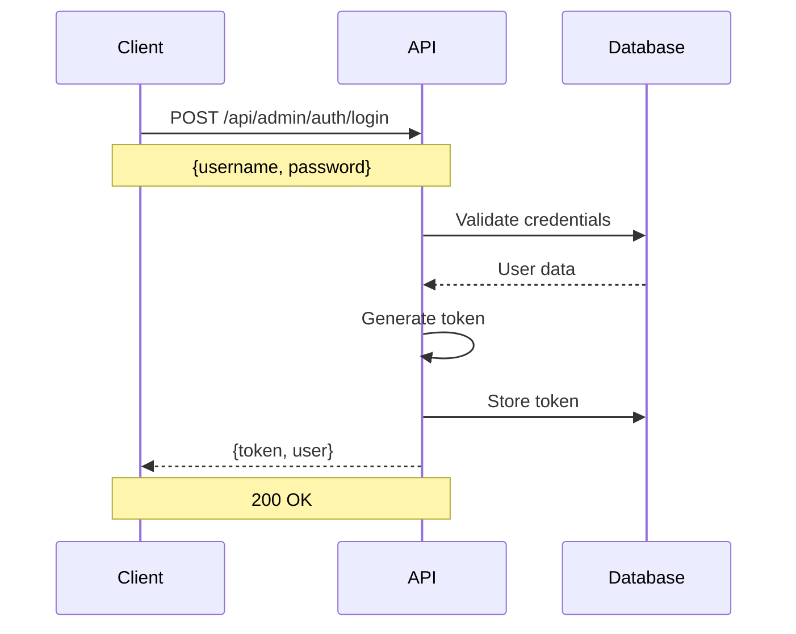
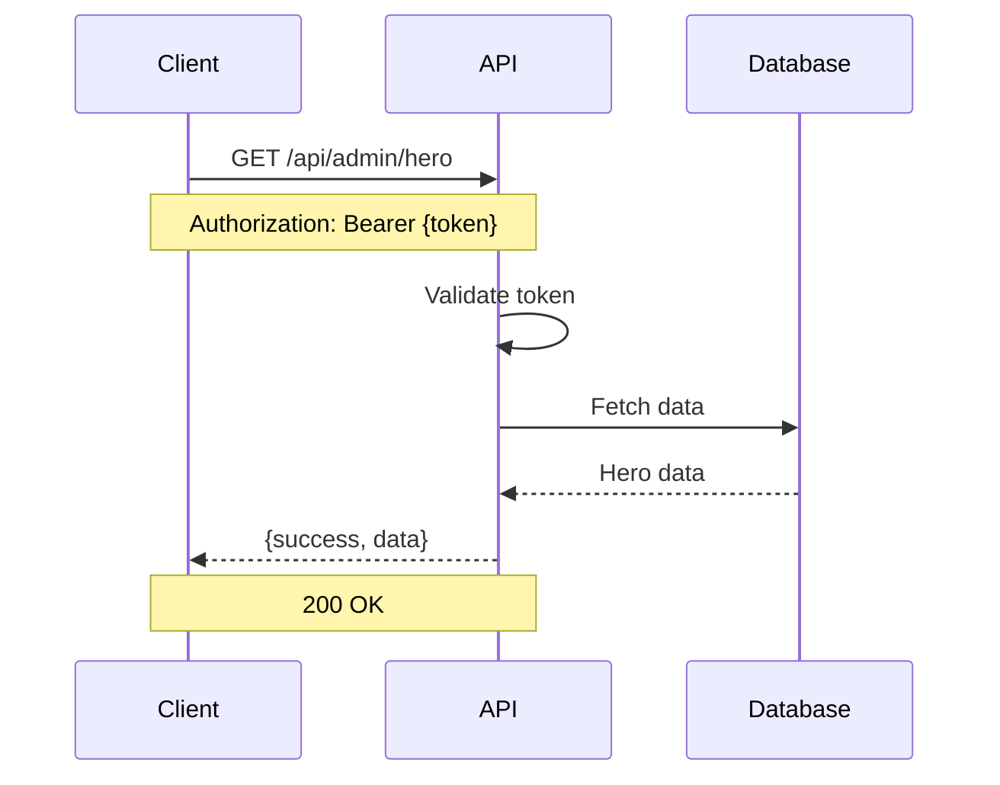
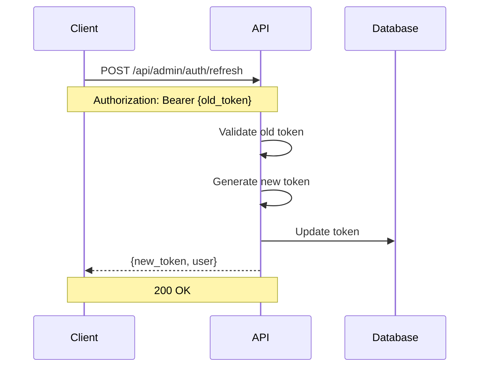

# Authentication Flow Guide

This guide provides detailed information about implementing authentication with the Laravel Admin Backend API.

## Table of Contents

- [Overview](#overview)
- [Authentication Flow](#authentication-flow)
- [Token Management](#token-management)
- [Security Best Practices](#security-best-practices)
- [Code Examples](#code-examples)
- [Error Handling](#error-handling)
- [Testing Authentication](#testing-authentication)

## Overview

The Laravel Admin Backend API uses **Laravel Sanctum** for authentication, providing secure token-based authentication for admin users. All admin endpoints require a valid Bearer token obtained through the login process.

### Key Features

- 🔐 **Secure Token-Based Authentication** - JWT/Sanctum tokens with configurable expiration
- 🔄 **Token Refresh** - Extend token lifetime without re-authentication
- 👤 **User Session Management** - Track login sessions and user activity
- 🚪 **Secure Logout** - Proper token invalidation
- 📊 **Authentication Logging** - Comprehensive audit trail

## Authentication Flow

### 1. Initial Login



### 2. Authenticated Requests



### 3. Token Refresh



## Token Management

### Token Lifecycle

1. **Generation** - Created during successful login
2. **Usage** - Included in Authorization header for protected requests
3. **Refresh** - Extended before expiration
4. **Expiration** - Automatic invalidation after 24 hours (configurable)
5. **Revocation** - Manual invalidation during logout

### Token Format

```
Bearer 1|abcdefghijklmnopqrstuvwxyz1234567890
```

- **Prefix**: `Bearer ` (note the space)
- **Token**: Sanctum-generated token string
- **Length**: Variable, typically 40+ characters

### Token Storage

#### ✅ Recommended (Server-side)
```javascript
// Store in HTTP-only cookie (server-side)
// Automatically handled by Sanctum
```

#### ✅ Acceptable (Client-side with precautions)
```javascript
// Secure storage in mobile apps
const token = await SecureStore.setItemAsync('auth_token', tokenValue);

// Memory storage (lost on page refresh)
let authToken = null;
```

#### ❌ Not Recommended
```javascript
// Never store in localStorage or sessionStorage
localStorage.setItem('token', token); // Vulnerable to XSS

// Never store in regular cookies without security flags
document.cookie = `token=${token}`; // Vulnerable to XSS/CSRF
```

## Security Best Practices

### 1. Token Security

```javascript
// ✅ Always use HTTPS in production
const apiUrl = process.env.NODE_ENV === 'production' 
    ? 'https://api.nhatanh.dev' 
    : 'http://127.0.0.1:8000';

// ✅ Include proper headers
const headers = {
    'Authorization': `Bearer ${token}`,
    'Content-Type': 'application/json',
    'Accept': 'application/json',
    'X-Requested-With': 'XMLHttpRequest' // CSRF protection
};
```

### 2. Token Validation

```javascript
// ✅ Validate token before use
function isTokenValid(token) {
    if (!token) return false;
    
    // Check format
    if (!token.startsWith('Bearer ')) return false;
    
    // Check length
    const tokenPart = token.substring(7);
    if (tokenPart.length < 40) return false;
    
    return true;
}
```

### 3. Automatic Token Refresh

```javascript
class AuthManager {
    constructor() {
        this.token = null;
        this.refreshTimer = null;
    }
    
    async login(username, password) {
        const response = await fetch('/api/admin/auth/login', {
            method: 'POST',
            headers: {
                'Content-Type': 'application/json',
                'Accept': 'application/json'
            },
            body: JSON.stringify({ username, password })
        });
        
        if (response.ok) {
            const data = await response.json();
            this.setToken(data.data.token);
            this.scheduleRefresh();
            return data;
        }
        
        throw new Error('Login failed');
    }
    
    setToken(token) {
        this.token = token;
        // Store securely based on your platform
    }
    
    scheduleRefresh() {
        // Refresh token 5 minutes before expiration (24 hours - 5 minutes)
        const refreshTime = (24 * 60 - 5) * 60 * 1000;
        
        this.refreshTimer = setTimeout(async () => {
            try {
                await this.refreshToken();
                this.scheduleRefresh(); // Schedule next refresh
            } catch (error) {
                console.error('Token refresh failed:', error);
                this.logout(); // Force logout on refresh failure
            }
        }, refreshTime);
    }
    
    async refreshToken() {
        const response = await fetch('/api/admin/auth/refresh', {
            method: 'POST',
            headers: {
                'Authorization': `Bearer ${this.token}`,
                'Accept': 'application/json'
            }
        });
        
        if (response.ok) {
            const data = await response.json();
            this.setToken(data.data.token);
            return data;
        }
        
        throw new Error('Token refresh failed');
    }
    
    async logout() {
        if (this.token) {
            try {
                await fetch('/api/admin/auth/logout', {
                    method: 'POST',
                    headers: {
                        'Authorization': `Bearer ${this.token}`,
                        'Accept': 'application/json'
                    }
                });
            } catch (error) {
                console.error('Logout request failed:', error);
            }
        }
        
        this.token = null;
        if (this.refreshTimer) {
            clearTimeout(this.refreshTimer);
            this.refreshTimer = null;
        }
    }
}
```

## Code Examples

### React Implementation

```jsx
import React, { createContext, useContext, useReducer, useEffect } from 'react';

// Auth Context
const AuthContext = createContext();

// Auth Reducer
const authReducer = (state, action) => {
    switch (action.type) {
        case 'LOGIN_START':
            return { ...state, loading: true, error: null };
        case 'LOGIN_SUCCESS':
            return {
                ...state,
                loading: false,
                isAuthenticated: true,
                token: action.payload.token,
                user: action.payload.user,
                error: null
            };
        case 'LOGIN_FAILURE':
            return {
                ...state,
                loading: false,
                isAuthenticated: false,
                token: null,
                user: null,
                error: action.payload
            };
        case 'LOGOUT':
            return {
                ...state,
                isAuthenticated: false,
                token: null,
                user: null,
                error: null
            };
        case 'TOKEN_REFRESH':
            return {
                ...state,
                token: action.payload.token
            };
        default:
            return state;
    }
};

// Auth Provider
export const AuthProvider = ({ children }) => {
    const [state, dispatch] = useReducer(authReducer, {
        isAuthenticated: false,
        token: null,
        user: null,
        loading: false,
        error: null
    });
    
    const login = async (username, password) => {
        dispatch({ type: 'LOGIN_START' });
        
        try {
            const response = await fetch('/api/admin/auth/login', {
                method: 'POST',
                headers: {
                    'Content-Type': 'application/json',
                    'Accept': 'application/json'
                },
                body: JSON.stringify({ username, password })
            });
            
            const data = await response.json();
            
            if (response.ok) {
                dispatch({
                    type: 'LOGIN_SUCCESS',
                    payload: {
                        token: data.data.token,
                        user: data.data.user
                    }
                });
                
                // Store token securely
                localStorage.setItem('auth_token', data.data.token);
                
                return data;
            } else {
                throw new Error(data.message || 'Login failed');
            }
        } catch (error) {
            dispatch({
                type: 'LOGIN_FAILURE',
                payload: error.message
            });
            throw error;
        }
    };
    
    const logout = async () => {
        if (state.token) {
            try {
                await fetch('/api/admin/auth/logout', {
                    method: 'POST',
                    headers: {
                        'Authorization': `Bearer ${state.token}`,
                        'Accept': 'application/json'
                    }
                });
            } catch (error) {
                console.error('Logout error:', error);
            }
        }
        
        localStorage.removeItem('auth_token');
        dispatch({ type: 'LOGOUT' });
    };
    
    const refreshToken = async () => {
        if (!state.token) return;
        
        try {
            const response = await fetch('/api/admin/auth/refresh', {
                method: 'POST',
                headers: {
                    'Authorization': `Bearer ${state.token}`,
                    'Accept': 'application/json'
                }
            });
            
            const data = await response.json();
            
            if (response.ok) {
                dispatch({
                    type: 'TOKEN_REFRESH',
                    payload: { token: data.data.token }
                });
                
                localStorage.setItem('auth_token', data.data.token);
                return data;
            } else {
                throw new Error('Token refresh failed');
            }
        } catch (error) {
            console.error('Token refresh error:', error);
            logout();
        }
    };
    
    // Initialize auth state from storage
    useEffect(() => {
        const token = localStorage.getItem('auth_token');
        if (token) {
            // Verify token is still valid
            fetch('/api/admin/auth/me', {
                headers: {
                    'Authorization': `Bearer ${token}`,
                    'Accept': 'application/json'
                }
            })
            .then(response => response.json())
            .then(data => {
                if (data.success) {
                    dispatch({
                        type: 'LOGIN_SUCCESS',
                        payload: {
                            token: token,
                            user: data.data.user
                        }
                    });
                } else {
                    localStorage.removeItem('auth_token');
                }
            })
            .catch(() => {
                localStorage.removeItem('auth_token');
            });
        }
    }, []);
    
    return (
        <AuthContext.Provider value={{
            ...state,
            login,
            logout,
            refreshToken
        }}>
            {children}
        </AuthContext.Provider>
    );
};

// Custom hook
export const useAuth = () => {
    const context = useContext(AuthContext);
    if (!context) {
        throw new Error('useAuth must be used within an AuthProvider');
    }
    return context;
};

// Login Component
export const LoginForm = () => {
    const { login, loading, error } = useAuth();
    const [credentials, setCredentials] = useState({
        username: '',
        password: ''
    });
    
    const handleSubmit = async (e) => {
        e.preventDefault();
        try {
            await login(credentials.username, credentials.password);
            // Redirect to dashboard
        } catch (error) {
            console.error('Login failed:', error);
        }
    };
    
    return (
        <form onSubmit={handleSubmit}>
            <div>
                <label>Username:</label>
                <input
                    type="text"
                    value={credentials.username}
                    onChange={(e) => setCredentials({
                        ...credentials,
                        username: e.target.value
                    })}
                    required
                />
            </div>
            <div>
                <label>Password:</label>
                <input
                    type="password"
                    value={credentials.password}
                    onChange={(e) => setCredentials({
                        ...credentials,
                        password: e.target.value
                    })}
                    required
                />
            </div>
            {error && <div className="error">{error}</div>}
            <button type="submit" disabled={loading}>
                {loading ? 'Logging in...' : 'Login'}
            </button>
        </form>
    );
};
```

### Vue.js Implementation

```javascript
// auth.js - Pinia store
import { defineStore } from 'pinia';

export const useAuthStore = defineStore('auth', {
    state: () => ({
        token: null,
        user: null,
        isAuthenticated: false,
        loading: false,
        error: null
    }),
    
    actions: {
        async login(username, password) {
            this.loading = true;
            this.error = null;
            
            try {
                const response = await fetch('/api/admin/auth/login', {
                    method: 'POST',
                    headers: {
                        'Content-Type': 'application/json',
                        'Accept': 'application/json'
                    },
                    body: JSON.stringify({ username, password })
                });
                
                const data = await response.json();
                
                if (response.ok) {
                    this.token = data.data.token;
                    this.user = data.data.user;
                    this.isAuthenticated = true;
                    
                    // Store token
                    localStorage.setItem('auth_token', this.token);
                    
                    return data;
                } else {
                    throw new Error(data.message || 'Login failed');
                }
            } catch (error) {
                this.error = error.message;
                throw error;
            } finally {
                this.loading = false;
            }
        },
        
        async logout() {
            if (this.token) {
                try {
                    await fetch('/api/admin/auth/logout', {
                        method: 'POST',
                        headers: {
                            'Authorization': `Bearer ${this.token}`,
                            'Accept': 'application/json'
                        }
                    });
                } catch (error) {
                    console.error('Logout error:', error);
                }
            }
            
            this.token = null;
            this.user = null;
            this.isAuthenticated = false;
            localStorage.removeItem('auth_token');
        },
        
        async refreshToken() {
            if (!this.token) return;
            
            try {
                const response = await fetch('/api/admin/auth/refresh', {
                    method: 'POST',
                    headers: {
                        'Authorization': `Bearer ${this.token}`,
                        'Accept': 'application/json'
                    }
                });
                
                const data = await response.json();
                
                if (response.ok) {
                    this.token = data.data.token;
                    localStorage.setItem('auth_token', this.token);
                    return data;
                } else {
                    throw new Error('Token refresh failed');
                }
            } catch (error) {
                console.error('Token refresh error:', error);
                this.logout();
            }
        },
        
        initializeAuth() {
            const token = localStorage.getItem('auth_token');
            if (token) {
                this.token = token;
                this.verifyToken();
            }
        },
        
        async verifyToken() {
            try {
                const response = await fetch('/api/admin/auth/me', {
                    headers: {
                        'Authorization': `Bearer ${this.token}`,
                        'Accept': 'application/json'
                    }
                });
                
                const data = await response.json();
                
                if (data.success) {
                    this.user = data.data.user;
                    this.isAuthenticated = true;
                } else {
                    this.logout();
                }
            } catch (error) {
                this.logout();
            }
        }
    }
});
```

### PHP/Laravel Client Implementation

```php
<?php

class AdminApiClient
{
    private $baseUrl;
    private $token;
    private $httpClient;
    
    public function __construct($baseUrl)
    {
        $this->baseUrl = rtrim($baseUrl, '/');
        $this->httpClient = new \GuzzleHttp\Client([
            'timeout' => 30,
            'verify' => true, // Enable SSL verification in production
        ]);
    }
    
    public function login($username, $password)
    {
        $response = $this->httpClient->post($this->baseUrl . '/api/admin/auth/login', [
            'json' => [
                'username' => $username,
                'password' => $password,
            ],
            'headers' => [
                'Accept' => 'application/json',
                'Content-Type' => 'application/json',
            ],
        ]);
        
        $data = json_decode($response->getBody(), true);
        
        if ($data['success']) {
            $this->token = $data['data']['token'];
            return $data['data'];
        }
        
        throw new Exception($data['message'] ?? 'Login failed');
    }
    
    public function logout()
    {
        if ($this->token) {
            try {
                $this->httpClient->post($this->baseUrl . '/api/admin/auth/logout', [
                    'headers' => $this->getAuthHeaders(),
                ]);
            } catch (Exception $e) {
                // Log error but don't throw
                error_log('Logout error: ' . $e->getMessage());
            }
            
            $this->token = null;
        }
    }
    
    public function refreshToken()
    {
        if (!$this->token) {
            throw new Exception('No token to refresh');
        }
        
        $response = $this->httpClient->post($this->baseUrl . '/api/admin/auth/refresh', [
            'headers' => $this->getAuthHeaders(),
        ]);
        
        $data = json_decode($response->getBody(), true);
        
        if ($data['success']) {
            $this->token = $data['data']['token'];
            return $data['data'];
        }
        
        throw new Exception($data['message'] ?? 'Token refresh failed');
    }
    
    public function getCurrentUser()
    {
        $response = $this->httpClient->get($this->baseUrl . '/api/admin/auth/me', [
            'headers' => $this->getAuthHeaders(),
        ]);
        
        $data = json_decode($response->getBody(), true);
        
        if ($data['success']) {
            return $data['data']['user'];
        }
        
        throw new Exception($data['message'] ?? 'Failed to get user');
    }
    
    private function getAuthHeaders()
    {
        if (!$this->token) {
            throw new Exception('Not authenticated');
        }
        
        return [
            'Authorization' => 'Bearer ' . $this->token,
            'Accept' => 'application/json',
            'Content-Type' => 'application/json',
        ];
    }
    
    // Example API method
    public function getHeroContent()
    {
        $response = $this->httpClient->get($this->baseUrl . '/api/admin/hero', [
            'headers' => $this->getAuthHeaders(),
        ]);
        
        $data = json_decode($response->getBody(), true);
        
        if ($data['success']) {
            return $data['data'];
        }
        
        throw new Exception($data['message'] ?? 'Failed to get hero content');
    }
}

// Usage example
try {
    $client = new AdminApiClient('http://127.0.0.1:8000');
    
    // Login
    $loginData = $client->login('admin', 'password123');
    echo "Logged in as: " . $loginData['user']['username'] . "\n";
    
    // Get hero content
    $heroContent = $client->getHeroContent();
    echo "Hero greeting: " . $heroContent['greeting_en'] . "\n";
    
    // Logout
    $client->logout();
    echo "Logged out successfully\n";
    
} catch (Exception $e) {
    echo "Error: " . $e->getMessage() . "\n";
}
```

## Error Handling

### Common Authentication Errors

#### 1. Invalid Credentials (422)

```json
{
    "success": false,
    "message": "The given data was invalid.",
    "errors": {
        "username": ["The username field is required."],
        "password": ["The password field is required."]
    }
}
```

**Handling:**
```javascript
try {
    await login(username, password);
} catch (error) {
    if (error.status === 422) {
        // Display validation errors
        const errors = error.data.errors;
        Object.keys(errors).forEach(field => {
            console.error(`${field}: ${errors[field].join(', ')}`);
        });
    }
}
```

#### 2. Authentication Failed (401)

```json
{
    "success": false,
    "message": "Invalid credentials"
}
```

**Handling:**
```javascript
try {
    await login(username, password);
} catch (error) {
    if (error.status === 401) {
        // Show login error message
        setError('Invalid username or password');
    }
}
```

#### 3. Token Expired (401)

```json
{
    "success": false,
    "message": "Token has expired"
}
```

**Handling:**
```javascript
// Automatic token refresh on 401
const apiCall = async (url, options) => {
    try {
        const response = await fetch(url, options);
        
        if (response.status === 401) {
            // Try to refresh token
            await refreshToken();
            
            // Retry original request with new token
            options.headers.Authorization = `Bearer ${newToken}`;
            return fetch(url, options);
        }
        
        return response;
    } catch (error) {
        // If refresh fails, redirect to login
        if (error.message.includes('refresh')) {
            logout();
            window.location.href = '/login';
        }
        throw error;
    }
};
```

## Testing Authentication

### Manual Testing with cURL

```bash
# 1. Login
curl -X POST http://127.0.0.1:8000/api/admin/auth/login \
  -H "Content-Type: application/json" \
  -H "Accept: application/json" \
  -d '{"username":"admin","password":"password123"}'

# Response: {"success":true,"data":{"token":"1|abc123...","user":{...}}}

# 2. Use token for authenticated request
curl -X GET http://127.0.0.1:8000/api/admin/hero \
  -H "Authorization: Bearer 1|abc123..." \
  -H "Accept: application/json"

# 3. Refresh token
curl -X POST http://127.0.0.1:8000/api/admin/auth/refresh \
  -H "Authorization: Bearer 1|abc123..." \
  -H "Accept: application/json"

# 4. Logout
curl -X POST http://127.0.0.1:8000/api/admin/auth/logout \
  -H "Authorization: Bearer 1|abc123..." \
  -H "Accept: application/json"
```

### Automated Testing

```javascript
// Jest test example
describe('Authentication Flow', () => {
    let authToken;
    
    test('should login successfully', async () => {
        const response = await fetch('/api/admin/auth/login', {
            method: 'POST',
            headers: {
                'Content-Type': 'application/json',
                'Accept': 'application/json'
            },
            body: JSON.stringify({
                username: 'admin',
                password: 'password123'
            })
        });
        
        const data = await response.json();
        
        expect(response.status).toBe(200);
        expect(data.success).toBe(true);
        expect(data.data.token).toBeDefined();
        expect(data.data.user).toBeDefined();
        
        authToken = data.data.token;
    });
    
    test('should access protected endpoint', async () => {
        const response = await fetch('/api/admin/hero', {
            headers: {
                'Authorization': `Bearer ${authToken}`,
                'Accept': 'application/json'
            }
        });
        
        const data = await response.json();
        
        expect(response.status).toBe(200);
        expect(data.success).toBe(true);
    });
    
    test('should refresh token', async () => {
        const response = await fetch('/api/admin/auth/refresh', {
            method: 'POST',
            headers: {
                'Authorization': `Bearer ${authToken}`,
                'Accept': 'application/json'
            }
        });
        
        const data = await response.json();
        
        expect(response.status).toBe(200);
        expect(data.success).toBe(true);
        expect(data.data.token).toBeDefined();
        
        authToken = data.data.token;
    });
    
    test('should logout successfully', async () => {
        const response = await fetch('/api/admin/auth/logout', {
            method: 'POST',
            headers: {
                'Authorization': `Bearer ${authToken}`,
                'Accept': 'application/json'
            }
        });
        
        expect(response.status).toBe(200);
    });
    
    test('should reject requests with invalid token', async () => {
        const response = await fetch('/api/admin/hero', {
            headers: {
                'Authorization': 'Bearer invalid-token',
                'Accept': 'application/json'
            }
        });
        
        expect(response.status).toBe(401);
    });
});
```

## Conclusion

This authentication guide provides comprehensive information for implementing secure authentication with the Laravel Admin Backend API. Remember to:

- Always use HTTPS in production
- Store tokens securely
- Implement proper error handling
- Use automatic token refresh
- Follow security best practices
- Test authentication flows thoroughly

For additional help, refer to the main API documentation or the Postman collection for interactive testing.
